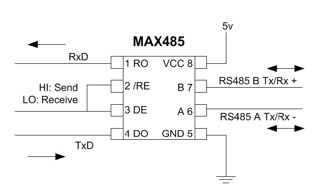
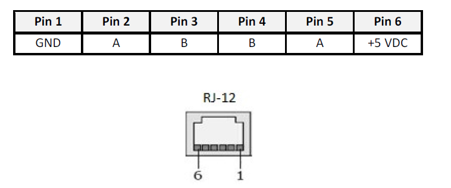
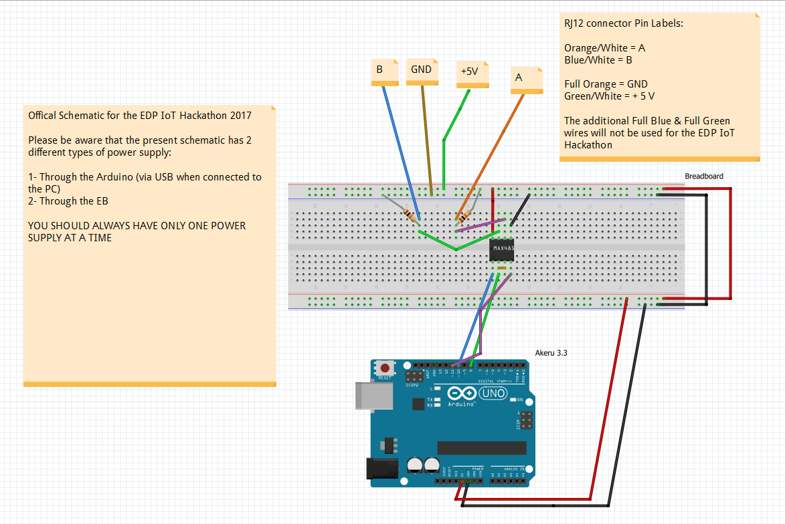

# **Hardware Setup**

## **Hardware Setup Introduction**

After carefully reading all the documentation regarding the [EB](hardware-intermediate-eb.md), the [Akeru board](hardware-intermediate-akeru.md) and the [Arduino IDE](hardware-beginner-arduino101.md), you're now ready to connect the dots and start hacking.

## **Recommendations and Precautions**

We shall advise every participating team to read the [EDP IoT Hackathon 2017 regulation](http://edpiothackathon.edp.pt/Home/Regulation) and be aware that the EBs will be connected and fully functional as any other electrical device.

You should not go beyond the present documentation regarding the hacking and/or modification of the EBs. Also, please do not try the present challenge at home as the commercial EBs have the HAN interface sealed.

## **Akeru and EB Setup**

Every team will have access to one EDP IoT Hackathon Kit. This kit has inside:

* **Akeru beta 3.3** board with Sigfox [TD 1208R](http://rfmodules.td-next.com/docs/datashorts/TD1208%20Datashort.pdf) modem and a **half-wave antenna**
* **One Breadboard**
* **Two** **10K Ohm Resistors**
* **One IC MAX485**
* **Jump Wires**
* **One RJ12 connector**
* **One Microsoft Azure pass**

For the connection between the Akeru board and the EB you will need a circuit to convert RS-485 (from the EB) to [TTL 5V](https://en.wikipedia.org/wiki/Transistor%E2%80%93transistor_logic) (from the Akeru board) so we can correctly send and receive messages through the [Modbus Protocol](hardware-intermediate-eb.md#modbus-protocol).

To effectively convert TTL 5V - RS-485, you will use the [IC MAX485](https://www.maximintegrated.com/en/products/interface/transceivers/MAX485.html) integrated circuit that is included in the kit.

The IC MAX485 has the following schematic:

As you can see, the RX and TX pins from the Akeru board will be connected to the 1 (RO) and 4 (DO) MAX485 pins. We will also need another digital exit to change the ICMAX485 state from receiving mode to sending mode (and vice-versa).

The connection to the EB is made through pins 6 (A) and 7(B). These lines are symmetric and work in an alternate way.

We will also need two 10K Ohm resistors serving as internal line termination resistors.

The EB's RJ-12 socket has the following pin-out:

You should use a 5V power supply to feed the circuit. For that you have two choices:

* Use the Arduino board +5V pin (via PC connection)
* Use the EB +5V pin  

## **ATTENTION**: This schematic provides two possible ways of supplying power (+5V) to the circuit. Please only use one type at a time or you can damage the Akeru board and the circuit.**

## **ADVISE**: Start by building just the PC power feeding part of the circuit. When you're sure that your solution is receiving all data, include the EBs part and remove the PC power feeding cables.

The full schematic can be found bellow on [Fritzing](http://fritzing.org/home/).

*"Fritzing is an open-source hardware initiative that makes electronics accessible as a creative material for anyone. We offer a software tool, a community website and services in the spirit of Processing and Arduino, fostering a creative ecosystem that allows users to document their prototypes, share them with others, teach electronics in a classroom, and layout and manufacture professional pcbs."*

The file is a Fritzing specific type (.fzz) and so you will need to download the software from their [website](http://fritzing.org/download/). After that you can download the project at:

[EDP IoT Hackathon Schematic](http://fritzing.org/projects/edp-iot-hackathon-2017-schematic)

---
Go to the [Hardware Advanced Part - Build Your Own Hardware](hardware-advanced-byohw.md)

[Go Back](hardware-advanced.md)

