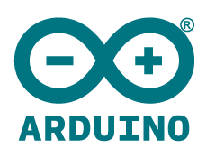

# **Arduino**



## **Arduino Introduction** 


[Arduino](www.arduino.cc) has been around for many years now and it's a popular tool among engineers 
and tech enthusiast.
That popularity comes from the fact that it's an open-source electronics' 
project based on easy-to-use hardware and software. Flexible enough for advanced users 
and easy enough to new ones. 

Its community has seen an enormous growth since the early days, 
including dozens of [Arduino-type boards](https://www.arduino.cc/en/Main/Products) 
and [projects](http://forum.arduino.cc/) to be inspired from. The fact that its IDE runs on Windows, 
MAC OS and Linux operating system gives full compatibility to anyone who wants to try it out.

From the [Arduino Introduction](https://www.arduino.cc/en/Guide/Introduction) page, 
we can see why Arduino is so popular:

1. **Inexpensive** - Arduino boards are relatively inexpensive compared to other microcontroller platforms. The least expensive version of the Arduino module can be assembled by hand, and even the pre-assembled Arduino modules cost less than $50


2. **Cross-platform** - The Arduino Software (IDE) runs on Windows, Macintosh OSX, and Linux operating systems. Most microcontroller systems are limited to Windows.

3. **Simple, clear programming environment** - The Arduino Software (IDE) is easy-to-use for beginners, yet flexible enough for advanced users to take advantage of as well. For teachers, it's conveniently based on the Processing programming environment, so students learning to program in that environment will be familiar with how the Arduino IDE works.


4. **Open source and extensible software** - The Arduino software is published as open source tools, available for extension by experienced programmers. The language can be expanded through C++ libraries, and people wanting to understand the technical details can make the leap from Arduino to the AVR C programming language on which it's based. Similarly, you can add AVR-C code directly into your Arduino programs if you want to.


5. **Open source and extensible hardware** - The plans of the Arduino boards are published under a Creative Commons license, so experienced circuit designers can make their own version of the module, extending it and improving it. Even relatively inexperienced users can build the breadboard version of the module in order to understand how it works and save money.


## **Arduino IDE & Programming Language**

The [Arduino IDE](https://www.arduino.cc/en/Guide/Environment) plays a fundamental role in the Arduino ecossystem and can be downloaded
from their [website](https://www.arduino.cc/en/Main/Software). We highly recommend downloading and using
its latest version (as of **December 2015**, **1.8.0**).

After successfully installing the IDE, one can use it for programming a compatible board. Arduino 
uses a **simplified C++** programming language with two fundamental structure functions: 
[setup](https://www.arduino.cc/en/Reference/Setup) and [loop](https://www.arduino.cc/en/Reference/Loop).
For all the details and functions available for you to use, you should check this 
[link](https://www.arduino.cc/en/Reference/HomePage).

## **Arduino libraries**

Arduino supports the use of libraries, which are basically **C++** 
source code files that makes it easier for the user to connect to whichever device/platform/software
he wants to.

To install a new library into your Arduino IDE you can use the Library Manager (available from IDE version 1.6.2). 
Open the IDE and click to the "Sketch" menu and then **Include Library > Manage Libraries**.

If you wish to manually import libraries you can go to **Include Library > Add .ZIP Library** and the 
Arduino IDE will automatically import the selected libraries. The default location should be **Documents\Arduino\libraries** on Windows OS.

## **Arduino Serial Monitor** 

You will use the Serial communication to connect your board to your computer. From the [Arduino site](https://www.arduino.cc/en/Reference/Serial) we can see that "all Arduino boards have at least one serial port (also known as a UART or USART): Serial. It communicates on digital pins 0 (RX) and 1 (TX) as well as with the computer via USB".

You can use the [SoftwareSerial Library](https://www.arduino.cc/en/Reference/SoftwareSerial) right out of the box as it's included in Arduino IDE 1.0 and later. Just type: 
```C++
#include <SoftwareSerial.h>
```

---
Go to the [Hardware Intermediate Documentation](hardware-intermediate.md)


[Go Back](hardware-beginner.md)