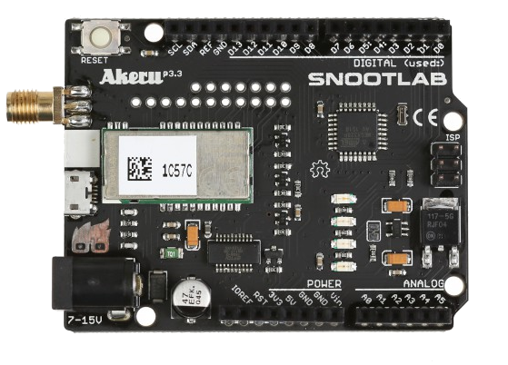
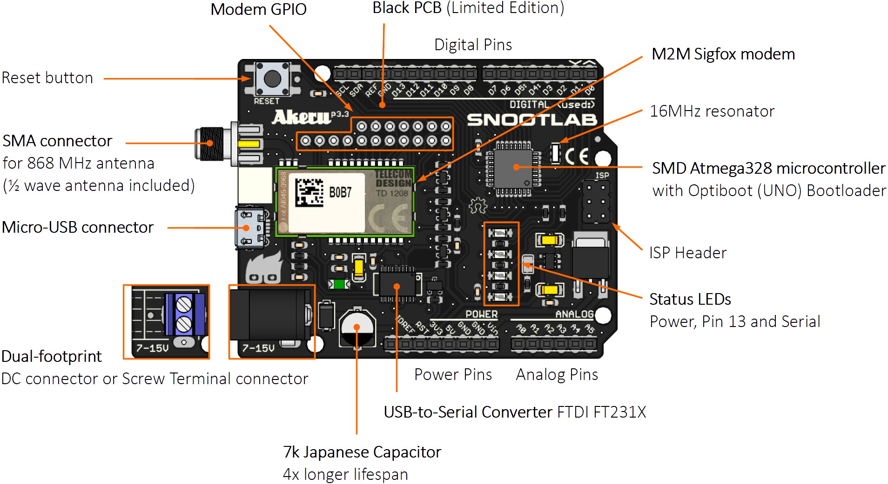

# **Akeru Beta 3.3 Board**


## **Akeru Introduction** 

Throughout the EDP IoT Hackathon, the [Akeru Beta 3.3 Board](http://snootlab.com/lang-en/snootlab-shields/829-akeru-beta-33-en.html) will be your favourite companion.



Buit by the French company [Snootlab](http://snootlab.com/), the Akeru Beta 3.3 Board is an [Arduino UNO](http://www.arduino.org/products/boards/arduino-uno) on steroids. It has a Sigfox [TD1208R modem](http://rfmodules.td-next.com/modules/td1208r/) built in and comes with a half-wave antenna.

## **Akeru Details** 

As said in the introduction, the Akeru Beta 3.3 is basicaly a modified version of the Arduino UNO board with built-in communication, allowing users to make prototypes with [Sigfox IoT technology](software-beginner-sigfox.md) and Arduino language.


Many applications have been developed with Akeru like water or electricity meter readings, hives weighing systems, run count or warning pollution. It gives you the possibility to use the [Sigfox IoT technology](software-beginner-sigfox.md) as easy as sending data to a serial port with Arduino. Nothing complicated to configure.

Below, we can see the schematics for the Akeru Beta 3.3.



For a 3D model of the board, please refer to this [Sketchfab link](https://sketchfab.com/models/c44f286234a2471487a29f2c716a52e0).

## **Warning**: Please note that during the EDP IoT Hackathon, every team will have one, and only one, Akeru Beta 3.3 board to work on. We will not take responsability for any destroyed Akeru board.

## **Advice**: Always connect the antenna before powering the card (otherwise the energy normally dissipated in the antenna will be converted into heat in the modem and can destroy it).**


## **Akeru Libraries** 

As any other Arduino board, the Akeru Beta 3.3 supports the use of [Arduino Libraries](hardware-beginner-arduino101.md#arduino-libs). Just follow the instructions to correctly start using them.

The [Akeru library](https://github.com/Snootlab/Akeru) is an Arduino library built especially for the Akeru/Akene boards and currently on version v4 (2016.07.29). It has more than 10 functions regarding the connectivity between the Sigfox module and the board.

An example would be:

```C++
#include <SoftwareSerial.h>
#include <Akeru.h>
/*   Snootlab device | TX | RX
               Akeru | D4 | D5
*/
#define TX 4
#define RX 5

Akeru akeru(RX, TX); //initalize akeru variable on RX and TX pins
akeru.begin(); // returns 1 when everything went ok
int val = analogRead(0);
String valString = akeru.toHex(val); //convert to Hexadecimal
akeru.sendPayload(varString); //send the payload through Sigfox
```

For additional information, please check the complete documentation for this library (in English and French) in [Snootlabs' specific forum](http://forum.snootlab.com/viewtopic.php?f=51&t=1509)

We also advise you to give the [Akeru examples](https://github.com/Snootlab/Akeru/tree/master/examples) a try before testing the board with the EBs. This way you can assure that your board is sending all data to the Sigfox backend.

---
Go to the [EDP Box documentation](hardware-intermediate-eb.md)


[Go Back](hardware-intermediate.md)