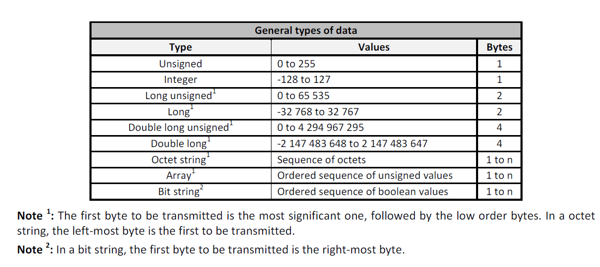

# **EDP Box Communication Libraries**


In order to ease the process of communicating with the EBs, we **highly reccommend** using the following libraries for the [Akeru Beta 3.3 board](hardware-intermediate-akeru.md).

To visualize all the data coming from the EB in your computer, use the default [SoftwareSerial library](https://www.arduino.cc/en/Reference/softwareSerial).

You can use the default [SoftwareSerial library](hardware-beginner-arduino101.md#arduino-serial-monitor) that comes with all Arduino IDE packages.

## **Modbus-Master-Slave for Arduino**

The Modbus-Master-Slave-for-Arduino is a library that provides a Serial Modbus implementation for [Arduino](hardware-beginner-arduino101.md). A primary goal was to enable industrial communication for the Arduino in order to link it to industrial devices such as HMIs, CNCs, PLCs, temperature regulators or speed drives. 

It's totally open-source and you can use it for your debbug tests. It implements the most important functions of the Modbus protocol and it's robust enough to use in the **EDP IoT Hackathon**, if you wish so.

To install this library just refer to the [installing libraries](hardware-beginner-arduino101.md#arduino-libraries) part of this documentation.

Code examples for the Arduino IDE are included in the library's documentation. Take a look at the [examples folder](), especially the [software_serial_simple_master]().

In this case we'll have the following data types coming from the EBs:



**NOTE:** The version we're linking here is a forked version of the Modbus-Master-Slave-for-Arduino. It includes minor changes in order to work correctly with the EDP Boxes. The [Github original version](https://github.com/smarmengol/Modbus-Master-Slave-for-Arduino) may not work correctly.

For example you can send a EB request to read data values with the function:

```C++
void SendEBRequest(uint8_t u8id, uint8_t u8fct, uint16_t u16RegAdd, uint16_t u16CoilsNo, uint16_t *au16reg)
{
  /*
    u8id : slave address, in this case =1
    u8fct : function code (check documentation)
    u16RegAdd : start address in slave (check documentation)
    u16CoilsNo : number of elements (coils or registers) to read 
    au16reg : pointer to a memory array in the Arduino
  */
  telegram = {u8id, u8fct, u16RegAdd, u16CoilsNo, au16reg};
  Serial.println("**Sending Request to EB**");
  master.query(telegram); // send query (only once)
}
```

You will have two kinds of registers available to query the EBs:

* **FCT_READLOADPROFILE**, for reading the default last [Load Profile](hardware-intermediate-registers#load-profile)
* **FCT_READSINGLEREGISTER**, for reading [live single registers](hardware-intermediate-registers#data-tables)

## **EDP Comm**

We've created an Arduino library called [EDPComm]() in order to easily extract data from the EBs and to make as easy as calling a one line function to get values from the EB. It depends on the [Akeru library](https://github.com/Snootlab/Akeru) and the [Modbus-Master-Slave for Arduino](https://github.com/edphackathon/Modbus-Master-Slave-for-Arduino) (forked version) so you should always have this two libraries in your Arduino Library path.

The library also includes modified versions of Akeru (Sigfox related) and Modbus-Master-Slave for Arduino functions so **ALWAYS TRY TO USE** these instead of the original functions.

## **Advise**: Inspect and study the libraries carefully as they play a fundamental role in order to correctly extact valuable data from the EBs.

The library comes with an **example file** so you can easily understand all the functions we've built.

Please refer to the [Data Registers](hardware-intermediate-registers.md) part of this documentation to know more about how to extract specific values from the EBs.

---
Go to the [EDP Box Registers](hardware-intermediate-registers.md)


[Go Back](hardware-intermediate.md)