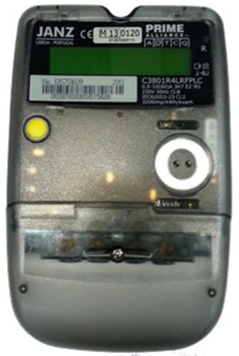
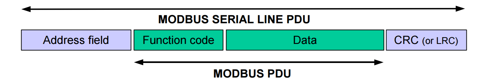
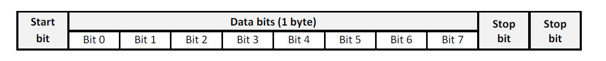

# **EDP Box**

## **EB Introduction** ##

The EDP Box (EB) is part of the InovGrid solution developed by EDP Distribuição and consists in a certified smart energy meter device that will substitute the old ones currently installed everywhere around Portugal.

In the EDP IoT Hackathon, all teams will have 10 EBs always available to test their solutions. The [JANZ C380 PRIME](http://www.janzce.pt/files/Cat__logo_C380_PRIME_PT.pdf) is a smart meter for active/reactive consumed/produced energy measurements in AC.

The user interface is as simple as clicking on the yellow button (as the picture above shows) to have access to data like:

* Hour
* Data
* Total Active Energy import (+A)
* Total Active Energy export (-A)
* Active Energy import - off-peak
* Active Energy import - peak
* Active Energy import - standard
* Active Energy export - off-peak
* Active Energy export - peak
* Active Energy export - standard
* Maximum Injected Power

## **EB Communication** ##

##  **Warning:** The HAN interface of every EB is normally SEALED and can not be used due to security and legal reasons but, for the EDP IoT Hackathon, all teams will have full access to this part of the EB through the [Modbus protocol](http://www.modbus.org/docs/Modbus_over_serial_line_V1_02.pdf).

## Modbus Protocol

Modbus is a request/reply protocol and offers services specified by function codes. It is an application layer messaging protocol, positioned at level 7 of the OSI model, which provides client/server communication between devices that can be connected on different types of buses or networks. In this case an asynchronous serial line protocol over [EIA-485](https://en.wikipedia.org/wiki/RS-485) (also known as **RS-485**) is used.

There can be only one master connected to the bus, and a maximum of 247 slaves (Ebs).

The Modbus frame is based on the following structure:

where:

* Address field: slave address (1 byte)
* Function code: Type of request (1 byte)
* Data: Data exchanged (0 up to 252 bytes)
* CRC: Cyclic Redundancy Check for error checking (2 bytes)

The maximum size of ModBus serial line PDU frame is 256 bytes.

For the transmission mode we have the following:

The first bit to be sent is the least significant of the byte. When there is more than one byte to be transmitted in the field of the message the most significant byte is sent first, followed by the lower order bytes. **By default the communication baud rate should be 9600 bps**.

## Physical Interface

The physical interface in the EDP Box is available through an RJ-12 socket, uses a one pair EIA-485 specification for half-duplex communication, and has a 5 Volt supply.

The RJ-12 socket pin-out is available as follows:

**Note:** The EDP Box must have an internal line termination resistor of at least 120Ω between A and B, and the interface should be able to supply current up to 150mA through the +5 VDC pin and GND.

---
Go to the [EDP Box Communication Libraries](hardware-intermediate-eb-comm.md)

[Go Back](hardware-intermediate.md)

