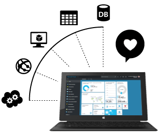

# Software Beginner

This guide will help you ramp up with the software part needed for the [EDP IoT Hackathon](http://edpiothackathon.edp.pt).

The challenge presented to you in this hackathon, requires assembling a cloud-based (Windows Azure) solution to collect all the readings from the EDP Box. This process of sending data to the Azure Platform is called data ingestion, and there are some available services that will help you achieve your goals.

But before that, let's dive into the Microsoft cloud platform called [Microsoft Azure](https://azure.microsoft.com).

We recommend you to follow this documentation:

- [Software Beginner](software-beginner.md)
    * [Getting Started with Azure](software-beginner-startingazure.md)  
    * [Microsoft Azure and IoT](software-beginner-azureiot.md)  
    * [SIGFOX](software-beginner-sigfox.md)  

- [Software Intermediate](software-intermediate.md)
    * [Continuing with Azure IoT](software-intermediate-azureiot.md)  
    * [Understanding SIGFOX](software-intermediate-sigfox.md)  
    * [Diving into Stream Analytics](software-intermediate-asa.md)  

- [Software Advanced](software-advanced.md)
    * [Azure IoT Scenarios](software-advanced.md#azure-iot-scenarios)  
        * [Remote Monitoring](software-advanced.md#remote-monitoring)  
        * [Predictive Maintenance](software-advanced.md#predictive-maintenance)  
    * [Data Visualization](software-advanced.md#data-visualization)  
    * [Other Azure Services](software-advanced.md#other-azure-services)  
        * [Logic Apps](software-advanced.md#logic-apps)  
        * [Azure Functions](software-advanced.md#azure-functions)  
        * [Notification Hub](software-advanced.md#notification-hub)  
  

Let's jump into it. How about with [Getting Started with Azure](software-beginner-startingazure.md)

---

[Go Back](/Documentation/readme.md)

