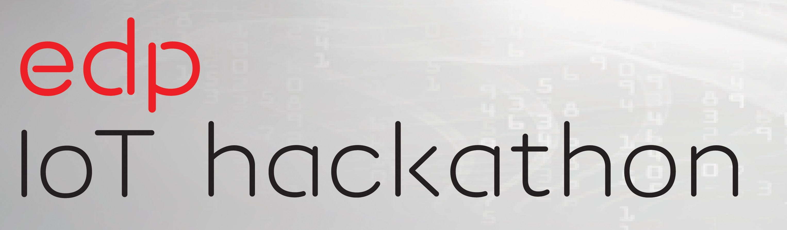
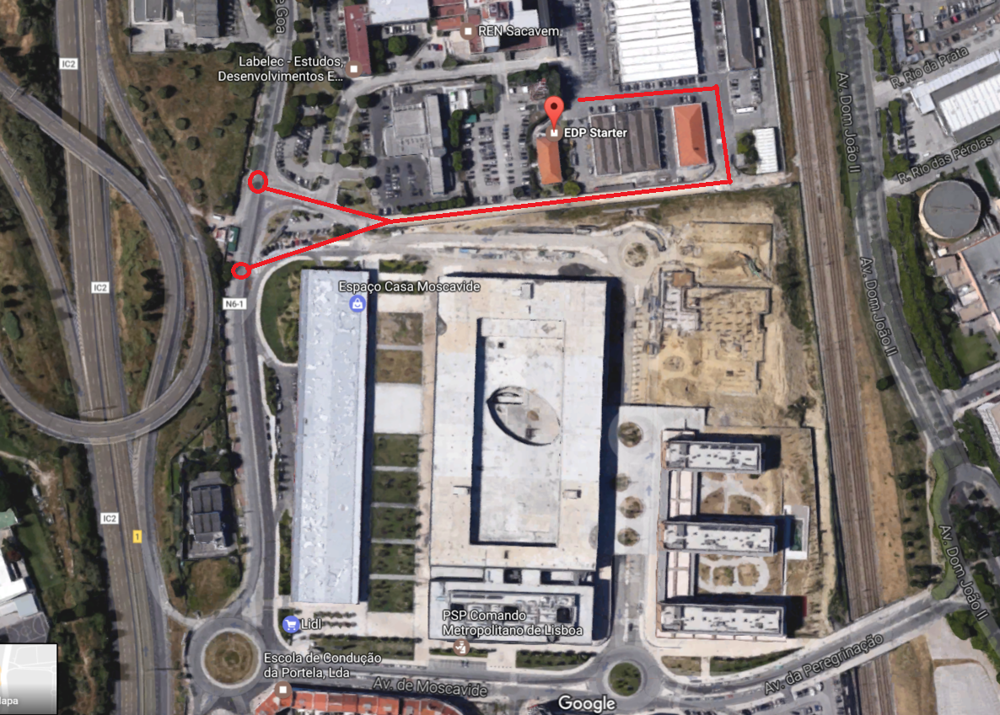
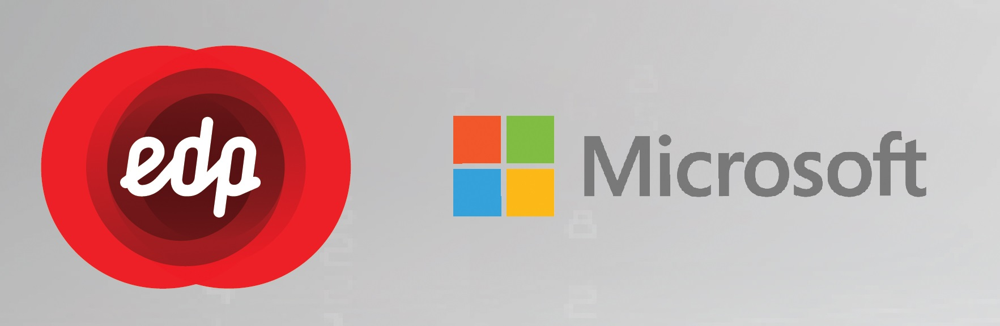
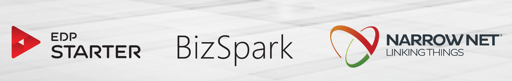

# EDP IoT Hackathon 2017

Official repository of the [EDP IoT Hackathon 2017](http://edpiothackathon.edp.pt/)

## **1.** **Useful information**
Below you can find some useful insights about the challenge. Please refer to the Hackathon 
Documentation for more technical questions.

### **1.2** **Agenda**

**Start Date**: February 8, 2017

**Checkpoint**: February 17, 2017

**End Date**: February 24, 2017

### **1.3** **Location**

The kick-off (08/02/2017) and end (24/02/2017) will take place at the [MAAT](https://goo.gl/maps/oqDVp2ZfSoN2) in Lisbon, Portugal.

The Checkpoint will take place at EDP Starter (from 10AM to 7PM).

During the hackathon, all teams are invited to come to
[EDP Starter HQ](https://goo.gl/maps/Sckm6r6PWuQ2) to work on their projects and interact with 10 available smart meters.
To get there coming from the N6-1 road, you should use the eastern entrance, as the picture shows:

**WARNING**: Please fill this [Doodle](http://doodle.com/poll/y4upguc6wvfen4ih) to let us know when you're coming to EDP Starter HQ. You must give your name to the security at the entrance. At least one mentor will be present everyday thoughout the 2 weeks at EDP Starter to welcome you in. 

### **1.4** **Mentors & Contacts**
For any questions regarding the EDP IoT Hackathon please visit the [website](http://edpiothackathon.edp.pt) and use the contact link in the footer.

Remember, you can contact [EDP IoT Hackathon Mentors](edpstarter@edp.pt) through EDP Starter's email. We will try to answer as soon as possible to your questions.

Some of the mentors will be present at EDP Starter throughout all **working days** of the EDP IoT Hackathon. Feel free to interact with them and ask any questions you may have.

### **1.4** **Website**

http://edpiothackathon.edp.pt/

## **2.** **Goals**

For the EDP IoT Hackathon, we want you to hack one EDP Box (EB), a part of the InovGrid 
solution developed by EDP Distribuição, and use that data to create
something valuable and unique with [Microsoft Azure](https://azure.microsoft.com/en-gb/). The challenge
will focus on two main areas: hardware and software, with different objectives and obstacles to overcome. 

### **2.1** **Hardware**

In the hardware part of the challenge, teams will be asked to use the provided 
[Akeru Beta 3.3](http://snootlab.com/lang-en/snootlab-shields/829-akeru-beta-33-en.html) board to:

* Connect to the EBs via HAN (Home Area Network) interface 
* Feed the circuit and the board through the HAN Interface (+5 VDC & GND pins). You should also be capable to do it via USB for debugging proposes.
* Communicate with the [Sigfox backend](https://backend.sigfox.com/welcome/news)

### **2.1** **Software**

In the software part of the challenge, teams will be asked to send data to [Microsoft Azure](https://azure.microsoft.com/en-gb/) 
via [Sigfox IoT Communication Protocol](https://www.sigfox.com/) such as:

* Live values (Active Power, Reactive Power, Current, etc...) ;
* Load profile values (15min period);

After that, to process the incoming data, all teams can use all services available in the [Microsoft Azure](https://azure.microsoft.com/en-gb/) platform or even open-source solutions. For data visualization the same applies. Be creative!

As an example, a team can use [Azure Stream Analytics](https://azure.microsoft.com/en-gb/services/stream-analytics/) inside [Azure IoT Hub](https://azure.microsoft.com/en-gb/services/iot-hub/) to process data and visualize it with [Power BI](https://powerbi.microsoft.com/en-us/).

**NOTE:** Every working solution MUST receive and send both Load Profile and Live values to the cloud.

## **3. Getting Started**

During the kick-off on February 8 2017, the EDP IoT Hackathon 2017 kit will be given to all particpating teams. 

### **Checklist:**
* **Akeru Beta 3.3** board with Sigfox TD 1208R modem and one **half-wave antenna**
* **Two** **10K Ohm Resistors**
* **One Breadboard**
* **One IC MAX485**
* **Jump Wires**
* **One Microsoft Azure pass**

**You will also need:**

* **[Modbus-Master-Slave-for-Arduino-master forked version](https://github.com/edphackathon/Modbus-Master-Slave-for-Arduino)**
* **[Snootlab's Akeru Official Library](https://github.com/Snootlab/Akeru)**
* **[EDPComm Library](/src/EDPComm-Hackathon-2017)**

**NOTE:** 

- Two 120 Ohm or higher resistors may also work.

- All teams MUST also have one **Micro-USB to USB-A cable** to connect the board to the PC.

## **4. Microsoft Azure Pass**

The Azure Pass provides customers with access to Microsoft Azure through one of nine offers. Customers then redeem these promo codes via the redemption site, [www.microsoftazurepass.com](www.microsoftazurepass.com), which entitles the customer to activate the corresponding offer. 
Passes are limited to 1-month, $100, whichever comes first. Unlike the Azure Access program. Azure passes do not require customer credit card information. 
Azure passes are typically used for customer PoC’s, field and partner training events, marketing campaigns, and other events.  

[Reedeem you Microsoft Azure Pass here](http://www.microsoftazurepass.com/)

## **5. Hackathon Documentation**

The official [Hackathon Documentation](Documentation/) serves as a guide for all participating teams and should be carefully read before starting the hack. It covers all levels of expertise from software beginner to hardware expertise. 

Teams that go for the extra-mile will have their efforts rewarded in the end so don't be affraid to look for alternative solutions to your problems. Check our tips about this in the advanced documentation sections. 

The [Hackathon Documentation](Documentation/) goal is to serve only as a reference. 

| **Hardware** | **Software** |
|--------------|--------------|
| **[Hardware Beginner](Documentation/hardware-beginner.md)**| **[Software Beginner](Documentation/software-beginner.md)** |
| -[Arduino Introduction](Documentation/hardware-beginner-arduino101.md)|  - [Getting Started with Azure](Documentation/software-beginner-startingazure.md)  |
| -[Akeru Board Introduction](Documentation/hardware-intermediate-akeru.md#akeru-introduction)|  -  [Microsoft Azure and IoT](Documentation/software-beginner-azureiot.md) |
|**[Hardware Intermediate](Documentation/hardware-intermediate.md)** |  -  [SIGFOX](Documentation/software-beginner-sigfox.md) |
|-[Akeru Board Details](Documentation/hardware-intermediate-akeru.md#akeru-details) | **[Software Intermediate](Documentation/software-intermediate.md)** |
| -[Akeru Board Libraries](Documentation/hardware-intermediate-akeru.md#akeru-libraries)|  -  [Continuing with Azure IoT](Documentation/software-intermediate-azureiot.md) |
| -[EDP Box Introduction](Documentation/hardware-intermediate-eb.md#eb-introduction)|  -  [Understanding SIGFOX](Documentation/software-intermediate-sigfox.md) |
| -[EDP Box Communication Libraries](Documentation/hardware-intermediate-eb-comm.md)|  -  [Diving into Stream Analytics](Documentation/software-intermediate-asa.md) |
|-[EDP Box Registers](Documentation/hardware-intermediate-registers.md) | **[Software Advanced](Documentation/software-advanced.md)** |
| **[Hardware Advanced](Documentation/hardware-advanced.md)**|  - [Azure IoT Scenarios](Documentation/software-advanced.md#azure-iot-scenarios) |
|   -[Setup and Schematics](Documentation/hardware-advanced-setup.md)|  - [Remote Monitoring](Documentation/software-advanced.md#remote-monitoring) |
|   -[Build Your Own Hardware](Documentation/hardware-advanced-byohw.md)|  - [Predictive Maintenance](Documentation/software-advanced.md#predictive-maintenance) |
| |  - [Data Visualization](Documentation/software-advanced.md#data-visualization) |
| |  - [Other Azure Services](Documentation/software-advanced.md#other-azure-services) |
| |    - [Logic Apps](Documentation/software-advanced.md#logic-apps) |
| |    - [Azure Functions](Documentation/software-advanced.md#azure-functions) |
| |    - [Notification Hub](Documentation/software-advanced.md#notification-hub) |

---

